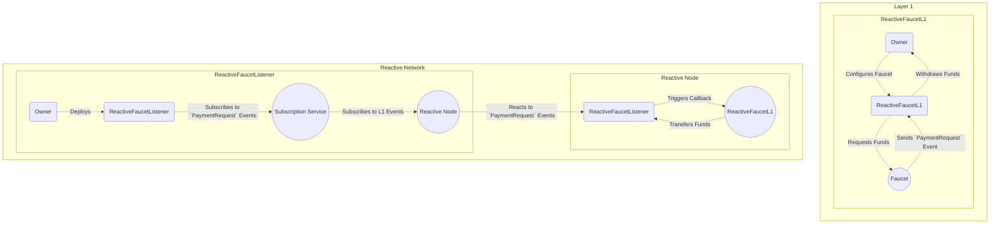

# Reactive Faucet

## Overview

This demo demonstrates a Reactive Faucet system that operates between Layer 1 (L1) and the Reactive Network. It enables users to request funds from a faucet contract deployed on L1 and receive them through a Reactive Faucet Listener contract deployed on the Reactive Network.

The flowchart legend:

* Owner: Manages faucet configuration and funds. Initiates and processes payment requests through `ReactiveFaucetL1`.

* Faucet: Provides funds upon request.

* `ReactiveFaucetListener`: Listens for payment requests from the Faucet and handles callbacks and fund transfers between layers.

* Subscription Service: Manages event subscriptions between layers.

* Reactive Node: Reacts to Layer 1 events and triggers callbacks to `ReactiveFaucetListener`.

* `ReactiveFaucetL1`: Initiates and processes payment requests, as well as receives transferred funds from the`ReactiveFaucetListener` contract.



## Origin Chain Contract

The `ReactiveFaucet` contract on L1 acts as the source of funds for the Reactive Faucet system. It allows the owner to set a maximum payout limit and facilitates fund transfers to recipients. Key functionalities include:

* Dispensing Funds: The dispense function allows the Reactive Faucet Listener contract on the Reactive Network to request fund transfers to specified recipients within the maximum payout limit.

* Configuration Management: The contract enables the owner to manage the maximum payout limit, the callback sender address, and the address of the Reactive Faucet Listener contract.

## Reactive Contract

The `ReactiveFaucetL1` contract serves as the faucet on the L1 chain. It allows users to request funds and withdraw funds as needed. Key functionalities include:

* Payment Request Event: The contract emits a PaymentRequest event when a user requests funds.

* Fund Management: Users can request funds from the faucet, and the contract ensures that the requested amount does not exceed the maximum payout limit set by the owner.

* Withdrawal Mechanism: The contract allows the owner to withdraw funds from the faucet as needed.

## Destination Chain Contract

The `ReactiveFaucetListener` contract deployed on the Reactive Network listens for payment requests initiated by the Reactive Faucet contract on L1. It facilitates the transfer of funds from the L1 faucet to designated recipients on the Reactive Network. Key functionalities include:

* Subscription to L1 Events: The contract subscribes to payment request events emitted by the Reactive Faucet contract on L1.

* Reacting to Events: Upon receiving a payment request event, the contract triggers a callback to the L1 faucet to initiate fund transfer to the specified recipient.

* Pause and Resume Mechanism: The contract provides functionality to pause and resume event subscriptions to manage its responsiveness.

## Further Considerations

While the demo provides a functional Reactive Faucet system, there are several areas for further improvement and refinement:

* Enhanced Security Measures: Implement additional security checks and access control mechanisms to prevent unauthorized access and ensure the safety of funds.

* Optimization for Gas Efficiency: Optimize contract functions and interactions to minimize gas costs and improve overall efficiency.

* Error Handling: Implement robust error handling mechanisms to handle exceptional scenarios and edge cases gracefully.

* Integration with External Systems: Explore opportunities to integrate the Reactive Faucet system with other DeFi protocols or applications to enhance its utility and functionality.

## Deployment & Testing

You will need the following environment variables configured appropriately to follow this script:

* `SEPOLIA_RPC`
* `SEPOLIA_PRIVATE_KEY`
* `REACTIVE_RPC`
* `REACTIVE_PRIVATE_KEY`
* `DEPLOYER_ADDR`
* `SYSTEM_CONTRACT_ADDR`
* `CALLBACK_SENDER_ADDR`

First deploy the L1 contract to Sepolia:

```
forge create --rpc-url $SEPOLIA_RPC --private-key $SEPOLIA_PRIVATE_KEY src/faucet/ReactiveFaucetL1.sol:ReactiveFaucetL1 --constructor-args 1ether
```

Assign the deployed contract address to the `REACTIVE_FAUCET_L1_ADDR` environment variable.

Now deploy the faucet itself to Reactive Network:

```
forge create --rpc-url $REACTIVE_RPC --private-key $REACTIVE_PRIVATE_KEY src/faucet/ReactiveFaucet.sol:ReactiveFaucet --constructor-args $CALLBACK_SENDER_ADDR 1ether
```

Assign the contract address to `REACTIVE_FAUCET_ADDR`.

Lastly, deploy the listener contract:

```
forge create --rpc-url $REACTIVE_RPC --private-key $REACTIVE_PRIVATE_KEY src/faucet/ReactiveFaucetListener.sol:ReactiveFaucetListener --constructor-args $SYSTEM_CONTRACT_ADDR $REACTIVE_FAUCET_L1_ADDR $REACTIVE_FAUCET_ADDR
```

Assign the contract address to `REACTIVE_FAUCET_LISTENER_ADDR`.

Finish the faucet configuration:

```
cast send $REACTIVE_FAUCET_ADDR "setReactive(address)" --rpc-url $REACTIVE_RPC --private-key $REACTIVE_PRIVATE_KEY $DEPLOYER_ADDR
```

Provide some liquidity:

```
cast send $REACTIVE_FAUCET_ADDR --rpc-url $REACTIVE_RPC --private-key $REACTIVE_PRIVATE_KEY --value 5ether
```

And test:

```
cast send $REACTIVE_FAUCET_L1_ADDR --rpc-url $SEPOLIA_RPC --private-key $SEPOLIA_PRIVATE_KEY --value 0.1ether
```
